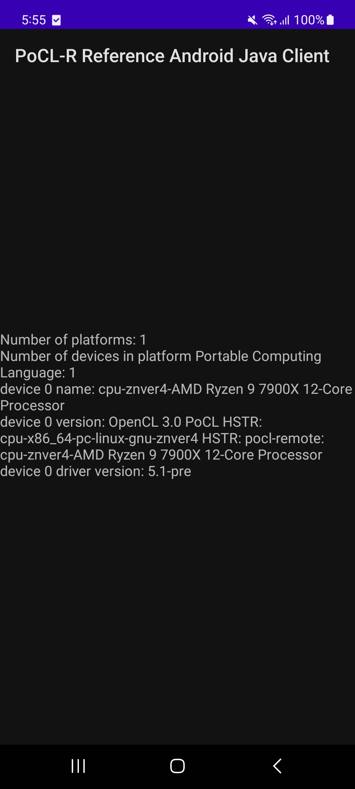

# PoCL-R Reference Android Java Client

This Repository provides a reference application that uses [JOCL](https://github.com/gpu/JOCL) to provide access to PoCL-R in Java.



## Getting started

### Prerequisites
In order to build the reference app, a number of programs are needed. Here is a list:
1. Head over to the [PortableCL docs](http://portablecl.org/docs/html/install.html) and install the required packages. 
2. To build JOCL, the use of Maven is also required. On Ubuntu, this can be installed with `sudo apt install maven`. 
3. Android Studio, the version used for development can be found in the "Relevant Versions" subsection. Make sure to use android studio in order to get the android development files also described in the "Relevant Versions" subsection. See "Installing Android packages" for details on how to do this.

### Cloning the repository
Clone the repo with its submodules with the following command:

```
git clone --recursive-submodules git@gitlab.tuni.fi:cs/cpc/pocl-r-reference-android-java-client.git
```

or initialize submodules after cloning with:

```
git submodule update --init --recursive
```

### Build JOCL
Go to `<source-dir>/external/JOCLRoot/` and run `./build_jocl.sh`. This will build JOCL for android with the same android parameters described in the "Relevant Versions" subsection. If you decide to use a different version, you also need to change that in the script.
> [note]
> This script only builds for `arm64-v8a`

### Build the app
Finally, open Android studio and build the app

## Relevant versions

Android constantly updates packages and libraries that can break with newer versions. Below is a list of relevent versions currently used:


| **What**                      | **Version**             | **where to check**                                                     |
|-------------------------------|-------------------------|------------------------------------------------------------------------|
| Android Studio                | Flamingo (2022.2.1)     | file > settings > appearance & behavior > system settings > updates    |
| JDK                           | 17                      | file > project structure > SDK Location > gradle settings > gradle JDK |
| Minimum SDK version           | 24                      | android/app/build.gradle > minSdk                                      |
| Targeted SDK version          | 33                      | android/app/build.gradle > targetSdk                                   |
| Gradle                        | 8.0                     | file > project structure > project > gradle version                    |
| Android Gradle plugin version | 8.0.2                   | file > project structure > project > android gradle plugin version     |
| CMake                         | 3.22.1                  | android/app/src/main/cpp/CMakeLists.txt > cmake_minimum_required       |
| NDK                           | 25.1.8937393            | (android layout in project tab) app/cpp/inlcudes/NDK                   |
| C++                           | 17                      | android/app/build.gradle > cppFlags '-std=c++\<version\>'              |

## Tips and Tricks

### Check that phone exposes the OpenCL library
Some phones provide a OpenCL library that can be used in C. This library needs to be whitelisted by the vendor. This can be checked like so:
1. adb into the phone
2. run:
    ```
    cat /vendor/etc/public.libraries.txt  
    ```
    and check that `libOpenCL.so` is there


### Installing Android packages

1. install Android Studio
2. install the android sdk from `Tools > SDK Manager > SDK Platforms`
3. install the android Native Development Kit (NDK) from `Tools > SDK Manager > SDK Tools`
4. install CMake from `Tools > SDK Manager > SDK Tools`

## Authors and acknowledgment
This project is made and maintained by the [CPC](https://www.tuni.fi/cpc/index.html) group.

## License

MIT License 
